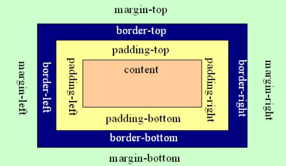

# 盒模型

CSS中我们可以将元素看出成一个个矩形盒子，对于页面的布局就是将不同盒子放在不同的位置。CSS中规定每个盒子分别由：内容区域、内边距区域、边框区域、外边距区域构成



## 1. 内容区域

内容区是整个盒子模型的中心，其中存放了盒子的主要内容，这些内容可以是文本、图像等资源。内容区有 width、height、overflow 三个属性，其中 width 和 height 属性用来指定盒子内容区域的宽度和高度，当内容信息过多，超出内容区所设置的范围时，则可以使用 overflow 属性设置溢出内容的处理方式，overflow 属性有四个可选值：

> 元素里面的所有子元素和文本内容都是在内容区域里面排列的，默认显示在左上角

- hidden：表示隐藏溢出的部分；
- visible：表示显示溢出的部分（溢出的部分将显示在盒子外部）；
- scroll：表示为内容区添加一个滚动条，您可以通过滑动这个滚动条来查看内容区的全部内容；
- auto：表示由浏览器决定如何处理溢出部分。

```css
div {
    width: 100px;
    height: 100px;
    background-color: red; /*添加背景色以便于观察*/
}
```


## 2. 边框区域

边框是环绕内容区和内边距的边界，你可以使用 border-style、border-width 和 border-color 以及它们的简写属性 border 来设置边框的样式。其中 border-style 属性为边框中最主要的属性，如果没有设置该属性的话，其它的边框属性也会被忽略。

> 边框的三要素：边框的粗细 边框的样式 边框的颜色

**边框线类型：**

|   值   |      描述      |
| :----: | :------------: |
|  none  | 默认：无边框。 |
| solid  |    定义实线    |
| dotted |    点状边框    |
| dashed |      虚线      |
| double |      双线      |

```css
/* 三个值分别表示： 四周边框大小   边框线类型   边框线颜色 */
div{ 
    border: 5px solid red; 
} 
```

```css
/* 设置上边框线 */
border-top: 样式 粗细 颜色;
/* 设置下边框线 */
border-bottom: 样式 粗细 颜色;
/* 设置左边框线 */
border-left: 样式 粗细 颜色;
/* 设置右边框线 */
border-right: 样式 粗细 颜色;
/* 再细分 */
border-bottom-color: blue;
border-bottom-style: dotted;
border-bottom-width: 3px;
border-left-color: red;
```


## 3. 内边距区域

内边距是内容区和边框之间的空间，你可以通过 padding-top、padding-right、padding-bottom、padding-left 以及它们的简写属性 padding 来设置内容区各个方向上与边框之间的距离。

|  取值  |              示例              |                          含义                          |
| :----: | :----------------------------: | :----------------------------------------------------: |
| 一个值 |        `padding: 10px`         |                  上下左右都设置为10px                  |
| 两个值 |      `padding: 10px 20px`      |             上下设置为10px，左右设置为20px             |
| 三个值 |   `padding: 10px 20px 30px`    |       上设置为10px，左右设置为20px，下设置为30px       |
| 四个值 | `padding: 10px 20px 30px 40px` | 上设置为10px，右设置为20px，下设置为30px，左设置为40px |


## 4. 外边距区域

外边距位于盒子模型的最外围，是边框之外的空间，通过外边距可以使盒子与盒子之间不会紧凑的连接在一起，是CSS布局中的一种重要手段。我们可以使用 margin-top、margin-bottom、margin-left、margin-right 以及它们的简写属性 margin 来设置各个方向上外边距的宽度。


## 5. 标准盒子和怪异盒子

默认情况下盒子的大小是由内容区、内边距、边框共同决定的

我们可以使用 `box-sizing` 属性来指定盒模型的尺寸计算方式

- content-box：默认值宽度和高度是用来设置内容区的大小
- border-box：宽度和高度是用来设置整个盒子的大小