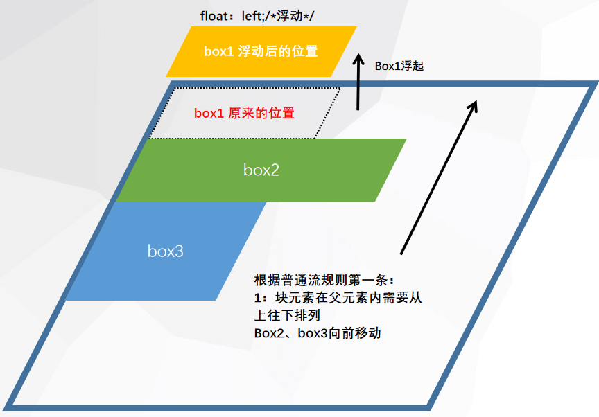

# 浮动

浮动可以使一个元素脱离自己原本的位置，并在父元素的内容区中向左或向右移动，直到碰到父元素内容区的边界或者其它浮动元素为止。

|  值   |     描述     |
| :---: | :----------: |
| left  | 元素向左浮动 |
| right | 元素向右浮动 |

普通文档流：浏览器在默认情况下规定一个块元素在父元素内的排列规则：

- 从上往下排列
- 从左开始排列
- 一个块元素占一行

```css
.parent {
    width: 800px;
    height: 400px;
    border: 10px solid blue;
}

.box1 {
    width: 250px;
    height: 80px;
    background-color: #ed7d31;
}

.box2 {
    width: 400px;
    height: 100px;
    background-color: #70ad47;
}

.box3 {
    width: 200px;
    height: 200px;
    background-color: #7030a0;
}
```

```css
<div class="parent">
    <div class="box1"></div>
    <div class="box2"></div>
    <div class="box3"></div>
</div>
```


浮动之后的文档流

```css
.parent {
    width: 800px;
    height: 400px;
    border: 10px solid blue;
}

.box1 {
    float: left;
    width: 250px;
    height: 80px;
    background-color: #ed7d31;
}

.box2 {
    width: 400px;
    height: 100px;
    background-color: #70ad47;
}

.box3 {
    width: 200px;
    height: 200px;
    background-color: #7030a0;
}
```




## 1. 浮动元素父级高度塌陷

当父级元素没有设置高度时，高度会由文档流内容撑开。而当子元素浮动之后，脱离了文档流，所以父级高度不会被撑开，这对我们后续的布局结构会造成很多困扰。

- 对于内容固定的元素,如果子元素都浮动,可以给父元素固定高度(例:导航栏)
- 在父元素的末尾添加空的块元素。设置clear:both;清除浮动
- 为父元素设置overflow:hidden;解决高度为0  

