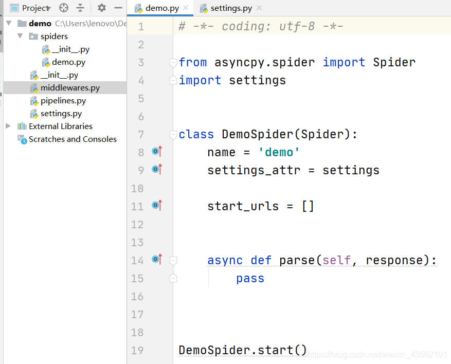

## Asyncpy使用文档

###创建项目

```stylus
asyncpy genspider demo

创建一个名为demo的项目。
创建成功之后， 打开项目文件，项目结构如下图所示：
```

</img>


###发送get和post请求

```python
# 在start_url 列表中添加一个链接。
# 在parse中，打印出响应状态码和内容
```

```python
# -*- coding: utf-8 -*-

from asyncpy.spider import Spider
import settings


class DemoSpider(Spider):
    name = 'demo'
    settings_attr = settings

    start_urls = ['http://httpbin.org/get']

    async def parse(self, response):
        print(response.status)
        print(response.text)

DemoSpider.start()

```

###使用start_requests发送POST请求

```stylus
导入Asyncpy的Request模块，清空start_urls ，然后重写 start_requests方法完成Post请求。
```

```python
from asyncpy.spider import Spider
import settings
from asyncpy.spider import Request

class DemoSpider(Spider):
    name = 'demo'
    settings_attr = settings

    start_urls = []

    async def start_requests(self):
        url = 'http://httpbin.org/post'
        yield Request(callback=self.parse,url=url,method="POST",data={"Say":"Hello Asyncpy"})

    async def parse(self, response):
        print(response.status)
        print(response.text)

DemoSpider.start()

```


### 自定义请求头

```stylus
方式一：settings中设置请求头
打开settings文件，找到最下面的 USER_AGENT 参数，解开注释后，添加一个浏览器的UA。

方式二：在middlewares中添加请求头
打开middlewares文件，找到UserAgentMiddleware方法(默认有)，也可以自定义一个方法。
然后到spider爬虫文件中(demo.py)，引入middlerwares文件中的 middleware 。 在start启动方法中传入middleware 
```

```python
# -*- coding: utf-8 -*-
from asyncpy.middleware import Middleware
from asyncpy.request import Request
from asyncpy.spider import Spider

middleware = Middleware()

@middleware.request
async def UserAgentMiddleware(spider:Spider, request: Request):
    ua = "Mozilla/5.0 (Windows NT 10.0; Win64; x64) AppleWebKit/537.36 (KHTML, like Gecko) Chrome/60.0.3100.0 Safari/537.36"
    request.headers.update({"User-Agent": ua})

```

```python
# -*- coding: utf-8 -*-

from asyncpy.spider import Spider
import settings
from asyncpy.spider import Request
from middlewares import middleware

class DemoSpider(Spider):
    name = 'demo'
    settings_attr = settings

    start_urls = []

    async def start_requests(self):
        url = 'http://httpbin.org/post'
        yield Request(callback=self.parse,url=url,method="POST",data={"Say":"Hello Asyncpy"})

    async def parse(self, response):
        print(response.text)

DemoSpider.start(middleware=middleware)

```


###添加代理IP

```stylus
打开middlewares文件，在方法下添加代理。(可以重新定义一个方法)
注意是在aiohttp_kwargs中添加proxy。记得在start方法中传入middleware
```

```python
@middleware.request
async def UserAgentMiddleware(spider:Spider, request: Request):
    ua = "Mozilla/5.0 (Windows NT 10.0; Win64; x64) AppleWebKit/537.36 (KHTML, like Gecko) Chrome/60.0.3100.0 Safari/537.36"
    request.headers.update({"User-Agent": ua})
    request.aiohttp_kwargs.update({"proxy": "http://49.85.98.209:4253"})
```


###修改指定爬虫文件的配置

```stylus
如果需要对不同爬虫文件进行不同的配置，可以使用 custom_settings 在爬虫文件中自定义配置。
并且需要在yield中，传入custom_settings。才能使自定义配置生效。
```

```python
# -*- coding: utf-8 -*-

from asyncpy.spider import Spider
import settings
from asyncpy.spider import Request
from middlewares import middleware

class DemoSpider(Spider):
    name = 'demo'
    settings_attr = settings
    custom_settings = {
        "DOWNLOAD_TIMEOUT":60,
        "RETRIES":3
    }

    start_urls = []

    async def start_requests(self):
        url = 'http://httpbin.org/post'
        yield Request(callback=self.parse,url=url,
                      method="POST",
                      data={"Say":"Hello Asyncpy"},
                      custom_settings=self.custom_settings
                      )

    async def parse(self, response):
        print(response.text)

DemoSpider.start(middleware=middleware)

```


###生成日志文件

```stylus
修改settings配置
# '''生成日志文件'''
# LOG_FILE = '../asyncpy.log'
# LOG_LEVEL = 'DEBUG'

多个爬虫指定日志文件
    custom_settings = {
        "LOG_FILE" : "../asyncpy.log"
    }

注意：这里跟上面相同，针对指定爬虫文件的日志，需要删除settings的日志配置，然后再通过custom_settings进行配置,如果不指定LOG_LEVEL 的话，日志等级默认为INFO
```


###解析response提取数据

```python
async def parse(self, response):
	print(response.text)
	print(response.xpath('//text()'))
	print(response.css(''))

# 注意：
"""
response.xpath()
	getall() : 返回的是一个list，里面包含了多个string
	get() : 返回的是string，list里面第一个string
	extract() 等于 getall()
	extract_first() 等于 get()
"""
```


###使用pipelines保存数据

```python
# -*- coding: utf-8 -*-
# 爬虫文件
from asyncpy.spider import Spider
import settings
from asyncpy.spider import Request
from middlewares import middleware
from pipelines import SpiderPipeline

class DemoSpider(Spider):
    name = 'demo'
    settings_attr = settings
    start_urls = []

    async def start_requests(self):
        url = 'http://httpbin.org/post'
        yield Request(callback=self.parse,url=url,
                      method="POST",
                      data={"Say":"Hello Asyncpy"},
                      custom_settings=self.custom_settings
                      )

    async def parse(self, response):
        item = {}
        item['text'] = response.text
        yield item
DemoSpider.start(middleware=middleware,pipelines=SpiderPipeline)
```