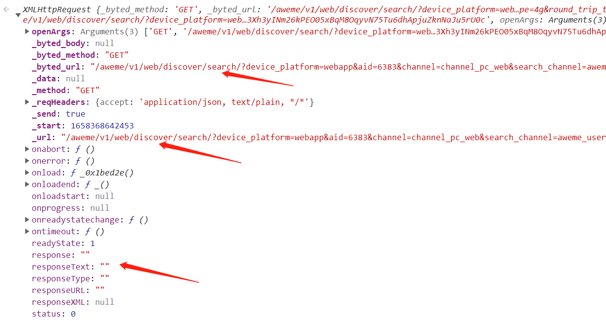
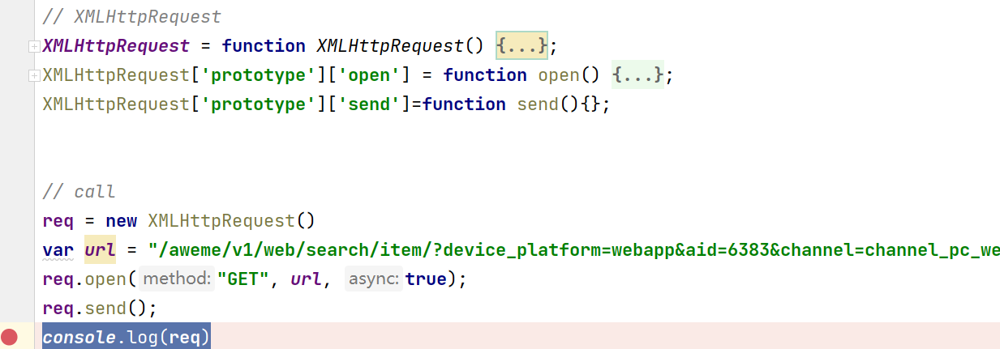
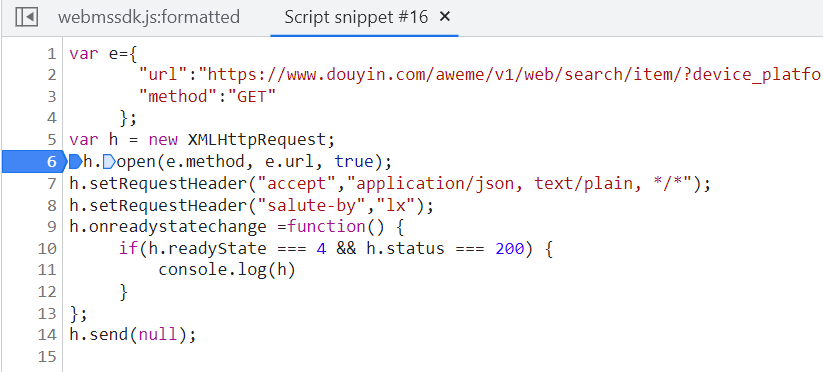
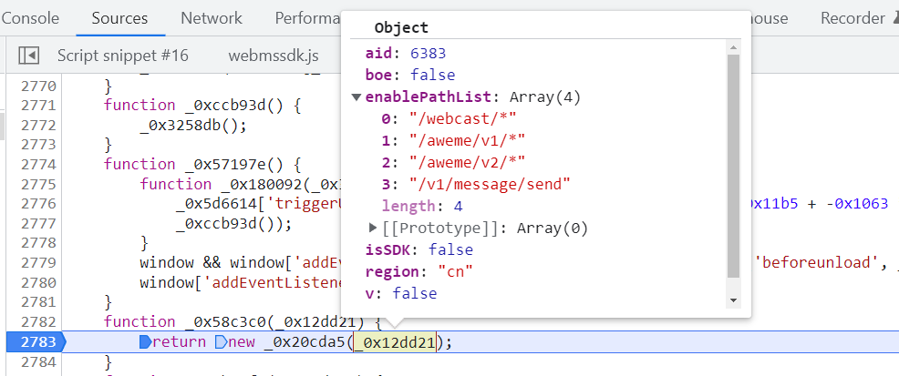

## 某音Web搜索RPC


### 流程分析

```stylus
通过搜索抓包，找到对应的请求包，通过包的堆栈信息到源码中并断点
```

</img>

```stylus
apply方法：能劫持另外一个对象的方法，继承另外一个对象的属性，apply方法接收两个参数
obj：这个对象将代替Function类里面的this对象
args：这个是数组，它将作为参数传递给function
```

</img>

```stylus
断点之后可知，t=this是XMLHttpRequest对象，观察请求，当前请求对象的_url中包含了signature和x-bogus
```

</img>

```stylus
那么现在需要找到未带有signature和x-bogus的请求对象。

在e.nativeXMLHttpRequestSend 时往前调试7步左右，发现一处和XMLHttpRequest有关的方法。
```

</img>

```stylus
在方法末尾的send处打上断点，然后放掉所有请求，重新触发断点。

此时可发现，在该断点的对象中，_url还未包含两个加密参数。
```

</img>

```stylus
那么F11继续往下走，可见进入了混淆的webmssdk中，其对请求对象被赋予了某些操作。
```

</img>

```stylus
当F8跳出这里回到最终的nativeXMLHttpRequestSend时，可发现_url中已经产生了两个签名。
```

</img>

```stylus
只需要这两个断点即可分析大概的流程，既先构建一个XMLRequest对象，然后通过改写send方法将其交给webmssdk中的方法加密，加密之后再回到 XMLHttpRequest.prototype.send 中，重置send方法完成请求。
```

</img>

```stylus
每个函数都有一个prototype属性，这个属性是指向一个原型对象，原型对象包含函数实例共享的方法和属性，
通俗来讲，当通过new来生成一个类的对象时，prototype对象的属性就会成为实例化对象的属性。
```


### 远程调用

```stylus
目前已经知道参数是怎么来的，就可以通过RPC方法来模拟生成。

虽然我们还没有具体追到加密的JS中，没有看到加密方法，但是由于其加密过程的特殊性，是基于操作XMLRequest对象的方法来进行调用，所以我们可以复刻过程生成参数

RPC是指跨进程间的远程调用过程，此处的意思是本地操作浏览器执行一些JS方法并返回结果。
```

####在浏览器构建请求进行测试：

</img>

####执行之后，查看控制台打印出的内容

</img>

### 实现思路

```stylus
当我们在当前环境中发送一个请求，其返回的内容中包含了带有签名的链接，同时可看到 responseText中已经返回了数据，那么说明整体的加密和请求都包含在了send中。

所以将这部分代码在本地模拟，比如通过selenium操作chromderver在网站环境中发送请求，即可进行简单的采集。
```

### 代码展示

```python
from selenium import webdriver


class DYSpider(object):

    def __init__(self):
        # 创建driver对象
        self.driver = webdriver.Chrome()
        """
        重点注意：
            自动化在执行后，driver对象就具备了所有的js环境
            以及加载了所有的服务器js代码，我们在执行js注入的时候
            是可以联动到服务器的js代码的
        """
        self.driver.get('https://www.douyin.com')

    def search_url_data(self, user_input):
        """
        执行js注入
        :return:
        """
        js_demo = """function queryData(url) {
               var p = new Promise(function(resolve,reject) {
                   var e={
                           "url":"https://www.douyin.com/aweme/v1/web/search/item/?device_platform=webapp&aid=6383&channel=channel_pc_web&search_channel=aweme_video_web&sort_type=0&publish_time=0&keyword=%s&search_source=normal_search&query_correct_type=1&is_filter_search=0&from_group_id=&offset=0&count=10&version_code=170400&version_name=17.4.0&cookie_enabled=true&screen_width=1920&screen_height=1080&browser_language=zh-CN&browser_platform=Win32&browser_name=Chrome&browser_version=102.0.5005.63&browser_online=true&engine_name=Blink&engine_version=102.0.5005.63&os_name=Windows&os_version=10&cpu_core_num=8&device_memory=8&platform=PC&downlink=10&effective_type=4g&round_trip_time=50&webid=7097114192884565534",
                           "method":"GET"
                         };
                    var h = new XMLHttpRequest;
                    h.open(e.method, e.url, true);
                    h.setRequestHeader("accept","application/json, text/plain, */*");  
                    h.setRequestHeader("salute-by","lx");  
                    h.setRequestHeader("content-type","application/json;charset=UTF-8");
                    h.onreadystatechange =function() {
                         if(h.readyState === 4 && h.status  ===200) {
                             resolve(h.responseText);
                         } else {}
                    };
                    h.send(null);
                    });
                    return p;
                }
            var p1 = queryData('lx');
            res = Promise.all([p1]).then(function(result){
                    return result
            })
            return res""" % (user_input)
        # 执行js
        # 因为js代码函数有返回值，再此处可以用变量接收
        response = self.driver.execute_script(js_demo)
        print(response[0])

    def close_driver(self):
        self.driver.close()
        self.driver.quit()


if __name__ == '__main__':
    d = DYSpider()
    d.search_url_data("热舞")
    d.search_url_data("夜骑")
    d.search_url_data("变装")
    d.close_driver()
```

### 继续调试

```stylus
我们需要在本地补上XMLReuqest，执行send方法，同时把webmssdk.js中的代码复制到本地运行

先复制webmssdk.js运行，根据报错在开头补环境

报错 Request is not defined，补：Request = function Request() {};
报错 Headers is not defined，补：Headers = function Headers() {};
报错 document is not defined，补：document = {}
报错 window is not defined，补：window = {}
报错document.addEventListener is not a function，补：document.addEventListener = function () {}

继续运行无报错，添加XMLReuqest代码并发送请求
```

</img>

```
虽然代码运行了，但是一直没有结束，代码中有setInterval和setTimeout 定时执行着方法
```

```javascript
setTimeout = function(){return function(){}};
setInterval = function(){};
```

</img>

```stylus
现在先把你所了解的、看到的环境信息都补上去

比如 screen、navigator、document、location、canvas、localStorage、sessionStorage、PluginArray、Image等等

结果补完之后还是啥都没有,此时就需要动手分析源码了

在本地代码断点可以看出，req.send()走了一次就结束了，方法没走到webmssdk.js的代码中，说明我们的调用没有成功
```

</img>

```stylus
用我们第一段中的代码调试，打上断点
```

</img>

```stylus
执行代码看断点怎么走的，和我们本地执行不同的是，目前可直接进入function _0x65f4c7()
```

</img>

```
那现在就需要对比本地和浏览器的区别在呢，像这类情况一般都是缺环境，或者是浏览器环境中有一些初始化的加载
```

</img>

```stylus
byted_acrawler是该页面独有的。(主要是最早的版本就需要byted_acrawler.init，所以一眼就看到了)
```

</img>

```stylus
加上init之后，再次运行代码
```

```javascript
window.byted_acrawler.init({
    aid: 6383,
    boe: false,
    enablePathList:  ['/webcast/*', '/aweme/v1/', '/aweme/v2/*','/v1/message/send'],
    isSDK:false,
    region: "cn",
    v:false
});
```

```stylus
报错：Cannot read properties of undefined (reading 'onabort')
定义：XMLHttpRequest.prototype.upload = function (){}

报错：Cannot read properties of undefined (reading 'init')
意思是window中未定义byted_acrawler，所以更没有init了。

所以可以猜这段代码中的byted_acrawler，没有附加到我们定义的window中，要么是缺环境，要么是补的window和源码的this不匹配。 那么加上window = this; 指向当前moudles

再次执行，成功返回结果
```

### 分析结果

```stylus
打印结果，发现req的onload中携带了send后加载的url，可发现经过两次计算，分别加上了X-Bogus和_signature
```

</img>

```stylus
本地能够成功调用之后，就可以着手还原这套调用流程，打上断点调试还原
大概补了下图的就能生成值，但是不保证能请求成功
补环境拿文字描述太过折磨，要补的东西毕竟多，一些简单的跳过了，各位自行尝试，珍重！
```

</img>

