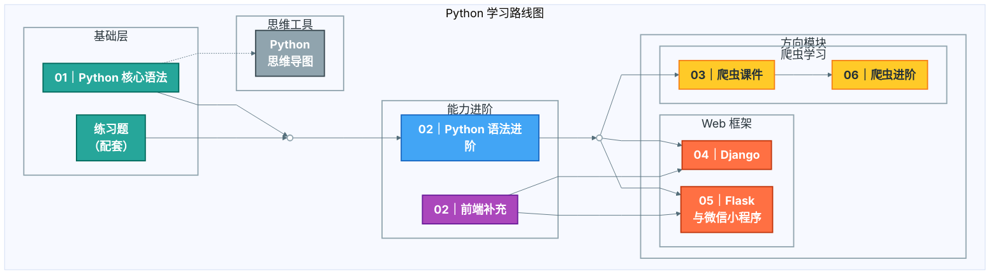

# Python学习笔记

  
  
  
  

本仓库整理了从 Python 基础语法、进阶语法、前端补充，到爬虫、Django、Flask/微信小程序等方向的学习资料与练习题，适合作为系统化复习与查阅的本地知识库。

## 快速入口 🔎

- [Python核心语法](01-python核心语法/) 🧩
- [Python语法进阶](02-Python语法进阶/)
- [前端补充](02-前端补充/) 🎨
- [爬虫课件](03-爬虫课件/) 🕷️
- [Django课件](04-Django/) 🌿
- [Flask与微信小程序](05-flask与微信小程序/) 🧪
- [爬虫进阶](06-爬虫进阶/) 🚀（含专题概览：[06-爬虫进阶/README.md](06-爬虫进阶/README.md)）
- [Python思维导图](Python思维导图/) 🧠
- [练习题](练习题/) ✅

## 仓库整体概览 🗺️

## 目录结构说明 🧭

- `01-python核心语法/`：变量、数据类型、流程控制、函数、作用域、装饰器、迭代器、文件操作、模块与包等。
- `02-Python语法进阶/`：面向对象、异常、网络编程、并发编程、MySQL 基础与进阶。
- `02-前端补充/`：HTML/CSS/JavaScript 基础、DOM/BOM、jQuery、Ajax 与常见布局。
- `03-爬虫课件/`：爬虫入门与进阶课件（requests、正则、BS4、XPath、反爬、验证码等）。
- `04-Django/`：Django 与 Linux 相关 PDF 课件（基础、进阶、高级、项目开发）。
- `05-flask与微信小程序/`：Flask 课件与微信小程序基础/进阶/项目扩展 PDF。
- `06-爬虫进阶/`：抓包工具、Appium、Asyncpy、加密与爬虫项目实战。
- `Python思维导图/`：Python 编程思维导图（`*.rar`）。
- `练习题/`：基础练习与综合题（`*.md`/`*.txt`）。

## 练习题入口 ✍️

- [python基础题.md](练习题/python基础题.md)
- [第一周练习.txt](练习题/第一周练习.txt)
- [第二周练习.txt](练习题/第二周练习.txt)
- [综合练习.txt](练习题/综合练习.txt)

## 学习路径建议 🧠

1. 先完成 `01-python核心语法/`，打牢语法与数据结构基础。
2. 进入 `02-Python语法进阶/`，理解面向对象、异常、网络与并发。
3. 如有 Web/前端需求，再看 `02-前端补充/`。
4. 对爬虫感兴趣，可按 `03-爬虫课件/` → `06-爬虫进阶/` 进阶。
5. Web 框架方向：`04-Django/` 或 `05-flask与微信小程序/`。

## 使用方式 📌

- 以目录为课程单元，按文件序号学习即可。
- Markdown 笔记适合边看边练；PDF 课件可作为体系化阅读材料。
- 建议配合 `练习题/` 做阶段性练习与复盘。

## 说明 ℹ️

- 本仓库为学习资料合集，包含图片、PDF、RAR 等附件，请保持目录结构不变。
- 若需要快速定位主题，可使用本地搜索（按关键词或文件名）。
